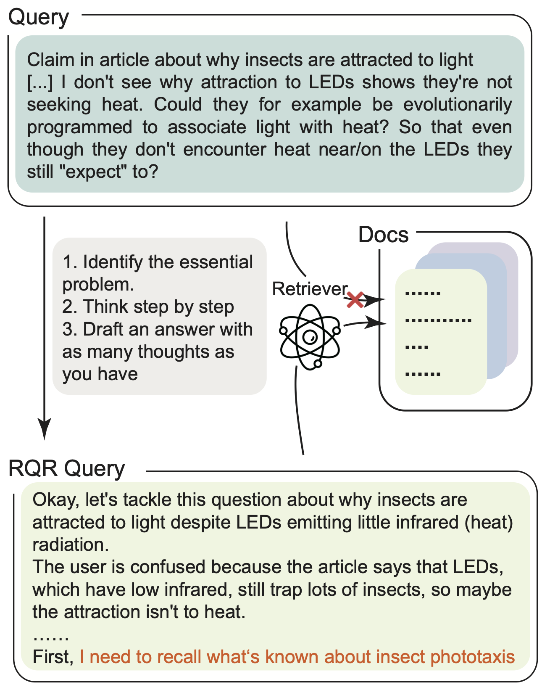
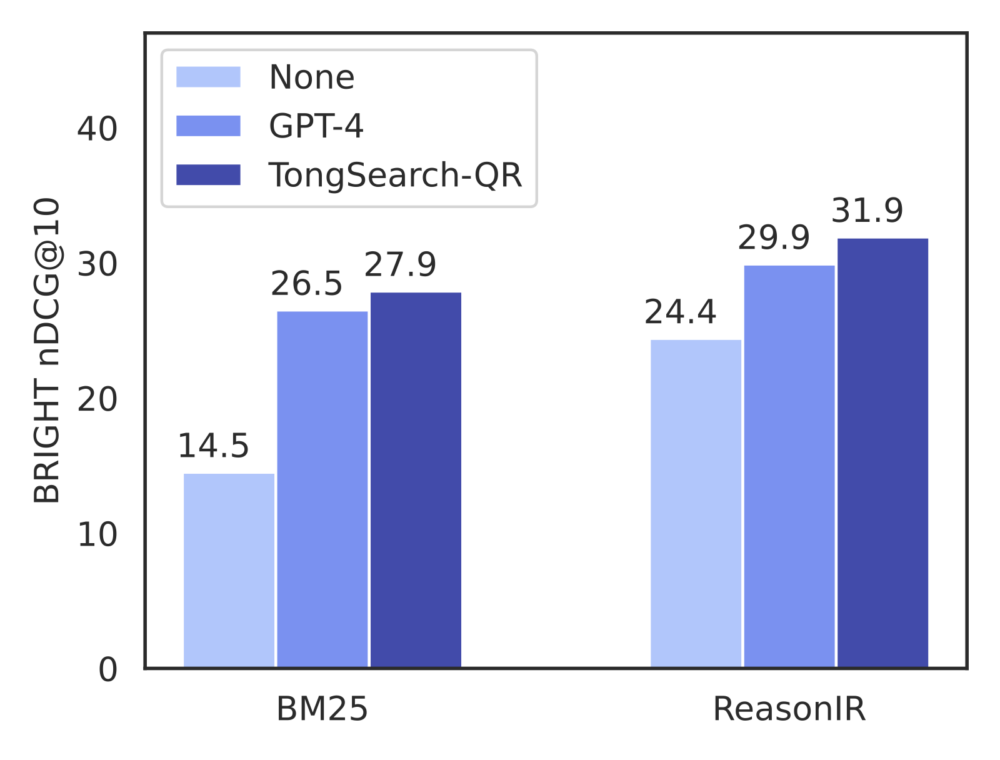

<h1 align="center">TongSearch QR: Reinforced Query Reasoning for Retrieval</h3>
<div align="center">
 <a href="https://arxiv.org/abs/2506.11603"></a>
</div>

<p align="center">
  
</p>

- Website: [TongSearch QR Website](https://bigai-nlco.notion.site/TongSearch-QR-Reinforced-Query-Reasoning-for-Retrieval-Tasks-1d6df56b182c80349d71ebfca4c55c1d)
- Models: [TongSearch QR 7B](https://huggingface.co/qratosone/TongSearch_Reasoner_7B), [TongSearch QR 1.5B](https://huggingface.co/qratosone/TongSearch_Reasoner_1_5B_V2_select)

## Introduction

**TongSearch QR** (Previously known as **TongSearch Reasoner**) is the first query reasoning model family adapted for query reasoning in **reasoning-intensive retrieval** tasks. "QR" is short of **query reasoning**. 

<p align="center">
  
</p>

The family includes two checkpoints in different parameter size: **TongSearch QR 1.5B** and **TongSearch QR 7B**. With BM25 as retriever, TongSearch Reasoner can perform closely to the state-of-the-art large reasoning models e.g. DeepSeek-R1 or QwQ-32B. Comparing with those large-scale embedders trained for reasoning-intensive task, the approaches of using BM25 retrievers with TongSearch QR reasoning is more effective and efficient since there is no need to encode the large-scale retrieval documents with large embedding models. Besides, TongSearch QR can also work with some retrievers specifically trained for reasoning-intensive retrieval tasks, e.g., [ReasonIR](https://github.com/facebookresearch/ReasonIR) to achieve better results.


## Evaluating on BRIGHT Benchmark
We provide a group of scripts for evaluating the overall performance on [BRIGHT Benchmark](https://brightbenchmark.github.io/). Here are the instructions of evaluation:
- Install `vllm==0.8.4` and `pytrec_eval` first.
- Install the other dependencies requrired by the evaluation scripts of BRIGHT benchmark. More details can be found at the repo of BRIGHT Benchmark [here](https://github.com/xlang-ai/BRIGHT).
- Replace the settings in `Evaluation/run_evaluation.sh` with your own settings: `TONGSEARCH_REASONER_PATH` for the path of TongSearch Reasoner model, `BRIGHT_PATH` for the path of the BRIGHT dataset, and `REASONER_FILE_NAME` for the filename of saving reasoned queries.
- Run `Evaluation/run_evaluation.sh`

We also provide the reasoned queries generated by TongSearch Reasoner 7B and 1.5B, which are listed in `Evaluation/reasoned_queries`. You can run the following scripts to evaluate with the reasoned queries directly:
```
#Evaluate 7B results
sh run_evaluation_with_reasoned_query.sh reasoned_queries/7b_reasoned_query.json path/to/bright/dataset
#Evaluate 1.5B results
sh run_evaluation_with_reasoned_query.sh reasoned_queries/1_5b_reasoned_query.json path/to/bright/dataset
```
## Citation
```
@misc{tongsearch,
	title = {TongSearch QR: Reinforced Query Reasoning for Retrieval},
	author = {Qin, Xubo and Bai, Jun and Li, Jiaqi and Jia, Zixia and Zheng, Zilong},
	url = {https://github.com/bigai-nlco/TongSearch_Reasoner}
}
```
