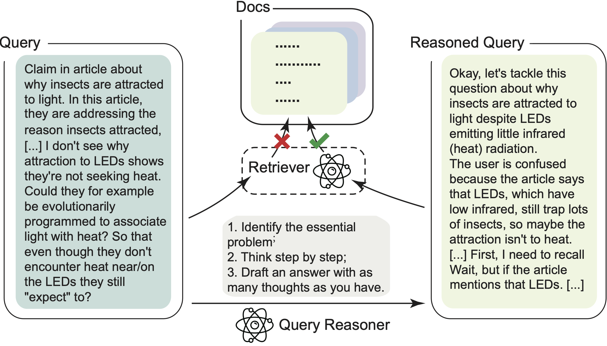
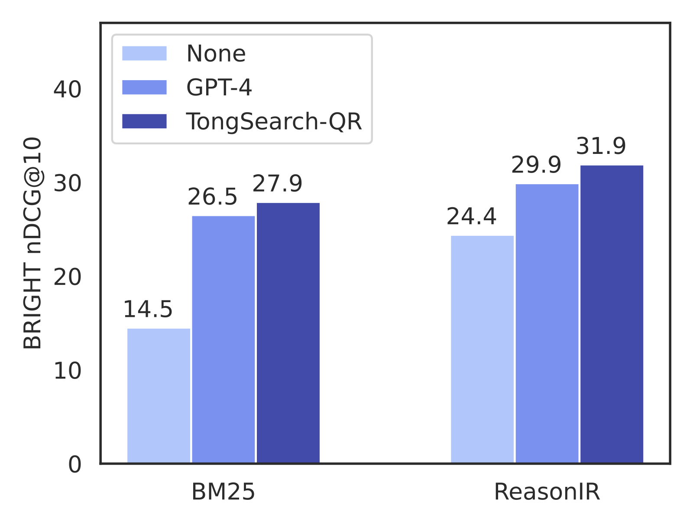
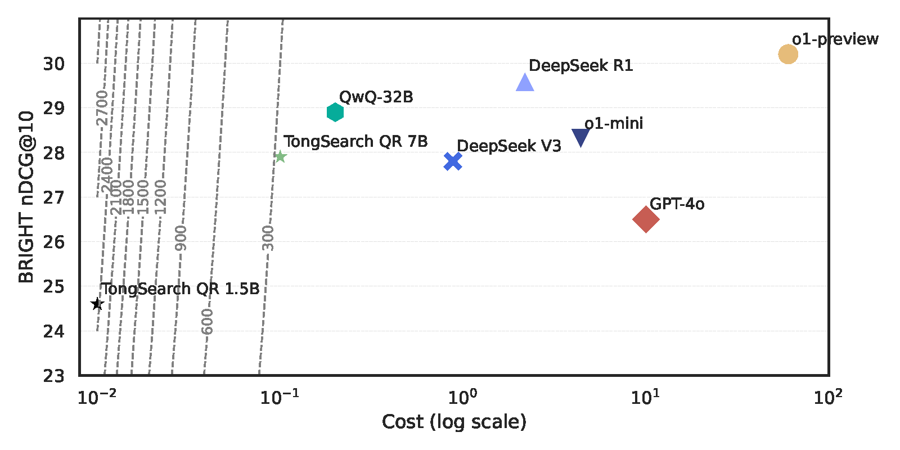
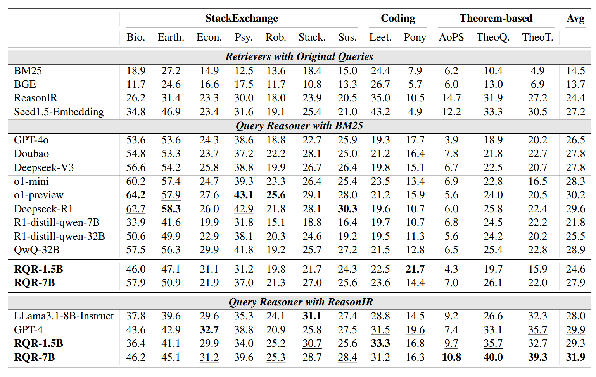

<div align="center">

# TongSearch QR: Reinforced Query Reasoning for Retrieval

<em></em>

<!-- BADGES -->
<!-- local repository, no metadata badges. -->

<a href="https://huggingface.co/TongSearch">
    
</a>
<a href="https://bigai-nlco.notion.site/TongSearch-QR-Reinforced-Query-Reasoning-for-Retrieval-Tasks-1d6df56b182c80349d71ebfca4c55c1d">
	
</a>
<a href="https://arxiv.org/abs/2506.11603">
	
</a>
<a href="https://github.com/bigai-nlco/TongSearch-QR/blob/main/LICENSE">
	
</a>
</div>

<p align="center">
  
</p>

<a name="highlights"></a>
## 💥 Highlights

**TongSearch QR** (Previously known as **TongSearch Reasoner**) is the first query reasoning model family adapted for query reasoning in **reasoning-intensive retrieval** tasks. "QR" is short of **query reasoning**. Currently, it includes: **TongSearch QR 1.5B** and **TongSearch QR 7B**.

<p align="center">
   
   
</p>

When equipped with standard retrievers, TongSearch-QR surpasses GPT-4 on BRIGHT (left figure) and achieves performance comparable to state-of-the-art large reasoning models, such as DeepSeek-R1 and QwQ-32B, while maintaining superior efficiency (right figure).


## 🗺️ Table of Contents

- [💥 Highlights](#-highlights)  
- [🤗 Available Models](#-available-models)  
- [🎯 Usage](#-usage)  
  - [Installation](#installation)  
  - [Run TongSearch-QR](#run-tongsearch-qr)  
- [🔥 Training](#-training)  
  - [Sample Training Questions](#sample-training-questions)  
  - [Build Training Dataset](#build-training-dataset)  
  - [Start Training](#now-lets-cook-tongsearch-qr)  
- [✍🏻 Evaluation](#evaluation)  
- [©️ License](#️-license)  
- [🔖 Citation](#citation)  


## 🤗 Available Models

- [**TongSearch-QR-1.5B**](https://huggingface.co/TongSearch/TongSearch-QR-1.5B)  🧠 Size: **1.5B** &nbsp; 📏 Sequence Length: **32K**

- [**TongSearch-QR-3B**](https://huggingface.co/TongSearch/TongSearch-QR-3B)  &nbsp;&nbsp; 🧠 Size: **3B**   &emsp; 📏 Sequence Length: **32K**

- [**TongSearch-QR-7B**](https://huggingface.co/TongSearch/TongSearch-QR-7B)  &nbsp;&nbsp; 🧠 Size: **7B**   &emsp; 📏 Sequence Length: **32K**


## 🎯 Usage

### Installation

Install dependencies:
```bash
❯ git clone https://github.com/bigai-nlco/TongSearch-QR
❯ cd TongSearch-QR
❯ conda env create -f environment.yml
❯ conda activate tongsearch
```

### Run TongSearch-QR

The following contains a code snippet illustrating how to use TongSearch-QR-7B to generate reasoning content for a given question.

```python
from transformers import AutoTokenizer, AutoModelForCausalLM

model_name = "TongSearch/TongSearch-QR-7B"

# load the tokenizer and the model
tokenizer = AutoTokenizer.from_pretrained(model_name)
model = AutoModelForCausalLM.from_pretrained(
    model_name,
    torch_dtype="auto",
    device_map="auto"
)

# prepare the model input
question = (
    "Why can't humans drink sea water? It would seem to be a huge evolutionary advantage for an animal "
    "to be able to drink sea water rather than have to rely on fresh water, and it's provably not impossible "
    "due to the existence of sea mammals that must filter the sea water somehow. Could someone explain to me any likely reasons that this is the case?"
)

prompt = (
    f"Instructions:\n"
    f"1. Identify the essential problem.\n"
    f"2. Think step by step to reason and describe what information could be relevant and helpful to address the questions in detail.\n"
    f"3. Draft an answer with as many thoughts as you have.\n"
    f"Query: {question}\n\n"
)

messages = [
    {"role": "user", "content": prompt}
]
text = tokenizer.apply_chat_template(
    messages,
    tokenize=False,
    add_generation_prompt=True,
)
model_inputs = tokenizer([text], return_tensors="pt").to(model.device)

# conduct text completion
generated_ids = model.generate(
    **model_inputs,
    max_new_tokens=1024
)
output_ids = generated_ids[0][len(model_inputs.input_ids[0]):].tolist() 

content = tokenizer.decode(output_ids, skip_special_tokens=True)

print("content:", content)
```


## 🔥 Training

### Sample Training Questions

You can directly use our sampled training questions for V1 and V2 training datasets in:

```bash
data_train/raw_data/V1.json
data_train/raw_data/V2.json
```

or you can randomly sample questions from [HuggingFace H4 Stack Exchange Preference Dataset](https://huggingface.co/datasets/HuggingFaceH4/stack-exchange-preferences) by:

```bash
❯ python ./scripts/data_process/sample_stackexchange.py --max-per-domain 1200 --save-path my_sample.json
```

### Build Training Dataset
We release the training questions with their reasoned results (for V1) / answers (for V2) in:
```bash
data_train/raw_data/V1-R1.json
data_train/raw_data/V1-QwQ.json
data_train/raw_data/V2.json
```
You can find their corresponding dataset file in:
```bash
data_train/built_dataset/V1-R1_no_think
data_train/built_dataset/V1-QwQ_no_think
data_train/built_dataset/V2_no_think
```
You can also transform your own reasoned data to the dataset format for subsequent training:
```bash
❯ python ./scripts/data_process/build_dataset.py \
         --input data_train/raw_data/V1-LRM.json \
		 --output-dir data_train/built_dataset \
		 --output-name V1-LRM_no_think
```

### Now, let's cook TongSearch QR!
Our training process uses GRPO implemented by [Huggingface TRL](https://github.com/huggingface/trl). First, launch the inference server for rollout:
```bash
❯ bash scripts/train/run_server.sh
```
Then, start the training process by:
```bash
❯ bash scripts/train/run_train.sh
```
*Make sure that the server is using different GPUs than the trainer, otherwise you may run into NCCL errors.

## ✍🏻 Evaluation
<a name="evaluation"></a>
We provide a group of scripts for evaluating the overall performance on [BRIGHT Benchmark](https://brightbenchmark.github.io/). After installing the dependencies requrired by the evaluation scripts of BRIGHT benchmark (see [here](https://github.com/xlang-ai/BRIGHT)). You may:

Use our reasoned results saved in:
```bash
data_evaluation/TongSearch-QR-1.5B_reasoned_BRIGHT_queries.json
data_evaluation/TongSearch-QR-7B_reasoned_BRIGHT_queries.json
```

or produce new reasoning results by:
```bash
❯ export CUDA_VISIBLE_DEVICES=0,1
❯ python scripts/evaluation/question_rewriting.py \
         --model_path TongSearch/TongSearch-QR-1.5B \
	     --output_file data_evaluation/TongSearch-QR-1.5B_reasoned_results.json
```

Then, you can run the following scripts to evaluate with the reasoned queries.
```bash
❯ bash scripts/evaluation/run_bright_eval.sh \
       bm25_with_reasoner \
       data_evaluation/TongSearch-QR-1.5B_reasoned_BRIGHT_queries.json \
       ./outputs
```

This should be able to reproduce our reported results:
<p align="center">
   
</p>


## ©️ License

TongSearch is licensed under the [MIT License](https://choosealicense.com/licenses). You are free to use, modify, and distribute this project under the terms of the MIT license.


## 🔖 Citation
```
@article{qin2025tongsearch,
      title={TongSearch QR: Reinforced Query Reasoning for Retrieval}, 
      author={Xubo Qin and Jun Bai and Jiaqi Li and Zixia Jia and Zilong Zheng},
      year={2025},
      eprint={2506.11603},
      archivePrefix={arXiv},
      primaryClass={cs.CL},
      url={https://arxiv.org/abs/2506.11603}, 
}
```
